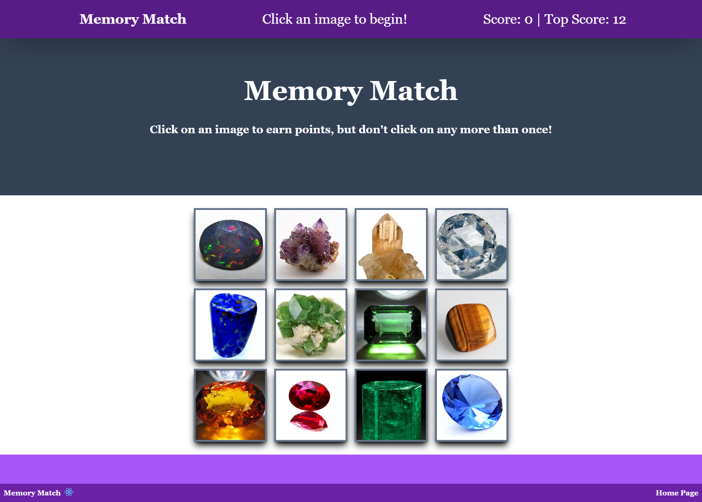

# Memory-Game

## Description
The purpose of this project was to reverse engineer the mechanics of a memory game, called "Clicky Game!". For comparison, the original game may be found on Netlify: https://clicky-game.netlify.app/ . In essence, both memory games present the user with a series of 12 cards. The user must click on each card once, and only once, to gain the maximum score. However, every time the user clicks on a card, all the cards are randomly reshuffled. One point is gained for every correct click (to a maximum of 12). If the user clicks on a card more than once the game ends and the user score returns to "0". The user's top score is retained until a higher score replaces it. When a correct click is made, header text indicates: "You guessed correctly!"; this text also flashes green. When an incorrect click is made, the header indicates "You guessed incorrectly!" and the text flashes red. In addition, an incorrect choice is emphasised with a horizontal shaking motion of the card display.

Although the game mechanics of "Clicky Game!" have been preserved in this project, the games are by no means identical. Some features, such as a homepage, have been added and there are differences in style, such as a change of the game's name to: "Memory Match". The game components have been built using React Router. This makes the code structure flexible as new levels or other features can easily be added to the game by re-using components such as the props for making game cards. The game is styled with Tailwind and this CSS package was used to make numerous custom animations both for the game and its homepage (which are stored in the tailwind.config.js file). The key operations of the game are handled with the useState hook, which is activated whenever the user initiates a click event on the game cards. This includes the random reshuffling of cards, the updating of the score and high score and ancillary operations such as the changing of header text and the relevant animations to indicate correct and incorrect user guesses. Image addresses, and other relevant information for the cards, are held in a json file (gems.json). The gemDisplay() function which sets up the cards uses a random number generator to store numbers from 1 to 12 in an array. This array, in turn, is used to construct a randomly ordered array of the objects contained in the json file, which is then passed through the map method (using props) to print 12 cards within a div element. This process is repeated whenever a user clicks one of the cards. As each card includes an id, a number from 1-12 stored as an id alongside each image in the gems.json file, the data from the click event is also employed to determine whether or not the card has already been clicked by applying the find method to an array of previously clicked id values. This array is updated by pushing the id value from a card click into it when the find method is unable to make a match (value === undefined). The code, at present, contains a number of unused page components. These will be employed in future expansions to create a game with multiple levels of increasing difficulty.

## Installation
N/A

## Usage
N/A

## Credits
N/A

## License
N/A

## Tests
N/A

## Questions
If you have any questions regarding the repo, please contact me at dra21@cam.ac.uk.
You can find more of my work at [DavidBlueLamassu](https://github.com/DavidBlueLamassu).

## https://zingy-kitten-6d9e38.netlify.app/

## Homepage

## Game

